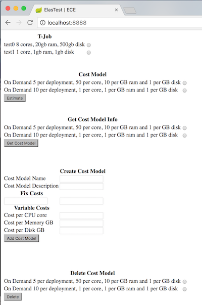
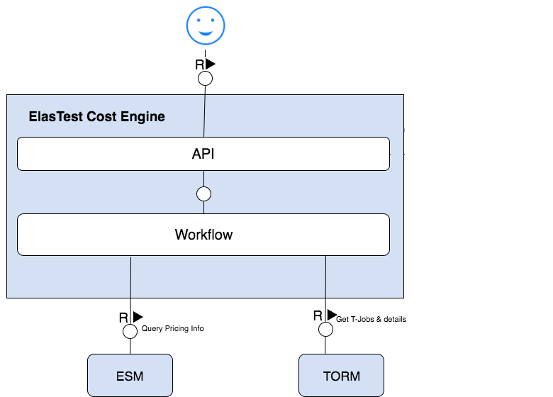

# ElasTest Cost Engine (ECE)

The Cost, Energy and Resource Consumption Modeling Engines (ECE) will be used in order to make ElasTest consider the financial of using clouds. Using clouds cost money, in third party clouds you pay for the time and resources you use. As well as in on-premises clouds, you pay for the energy and the hardware resources utilization. If ElasTest does not consider this aspects, the risk of not being financially sustainable appears.

The ECE is a service that needs information from the ElasTest Service Manager (ESM) and the ElasTest Platform Manager (EPM) for pulling information about the Platforms and Services Cost Models, and also needs information from the ElasTest Test Orchestration and Recommendation Manager (TORM) in order to know what T-Jobs can the ElasTest user estimate.

## Features

The version 0.1 of the ElasTest Cost Engine, provides the following features:

- Estimate basic costs of T-Job executions based on already existing cost models.
- Create and Manage Cost Models

## How to run

1. Install Docker.

2. Install Docker Compose. 

3. From the root folder, run the image using the following command: 
   - `sudo docker-compose up`

## Basic uasge

When the ECE is started correctly, a basic UI will be exposed at http://localhost:8888

The 0.1 version of ECE initializes the databases and includes two different Cost Models as initial values. The T-Jobs are 
mocked up until the DSL is correctly defined. 

The ECE UI offers the functionality to estimate the price of running a specified T-Job running under a Cost Model. 


The ECE UI also ofers a simple way to manage all the Cost Models, creating, deleting and requesting for the json structure.

## Use-case specific GUI

The ECE offers a set of separate graphical user interfaces for each of the following usecases:

- Create a Cost Model: http://localhost:8888/createcostmodel
- Delete a Cost Model: http://localhost:8888/deletecostmodel
- Get Cost Model details: http://localhost:8888/costmodeldetails
- Estimate a TJob and Cost Model cost: http://localhost:8888/estimate

---

## Development documentation


ECE is developed using Java and Spring MVC. 
### Architecture

The ElasTest Cost Engine has aims to provide a [HTTP Rest API](http://elastest.io/docs/api/ece/) that computes cost 
estimations for running T-Jobs under a concrete Infrastructure Cost Model.

ECE will be in contact with the following ElasTest services:
   - [The ESM](https://github.com/elastest/elastest-service-manager) will be used to query the Services pricing strategies.
   - [The EPM](https://github.com/elastest/elastest-platform-manager) will be used to query the Platform pricing strategies.
   - [The TORM](https://github.com/elastest/elastest-torm) will provide the T-Job details.
   - [The EMS](https://github.com/elastest/elastest-monitoring-service) will provide information about the running T-Jobs.


For now, the 0.1 version is using Mock up values to simmulate the interaction with the rest of the ElasTest Components.




The Cost Models are defined in a generic way so can be adapted to several cases from VM orchestrations, Service 
instantiations and Services that contain VM orchestration as part of them. The data model used is the following:

   - `name` : Name of the Cost Model.
   - `type` : Cost Model type.
   - `fix_cost` : Map containing the keys and values of the fields that need to be accounted in a fix bases.
   - `var_rate` : Map containing the keys and values of the fields that need to be accounted under a pay as you go premises.
   - `components` : Map containing the links to another Cost Models.
   - `description` : Description of the Cost Model.


An example of a Cost Model definition could be as the following:

```
{
  "name" : "CostModelX",
  "type" : "On Demand",
  "fix_cost" : {
    "deployment" : 12.5
  },
  "var_rate" : {
    "cpu_core" : 10, 
    "gb_ram" : 5, 
    "gb_ssd" : 0.6,
    "gb_hhd" : 0.0775
  },
  "components":{
    "Services" : ["CostModelYId"]
  },
  "description" : "On demand provisioning of a VM. Includes as a component a package X accounted by the Cost Model Y"
}
```
