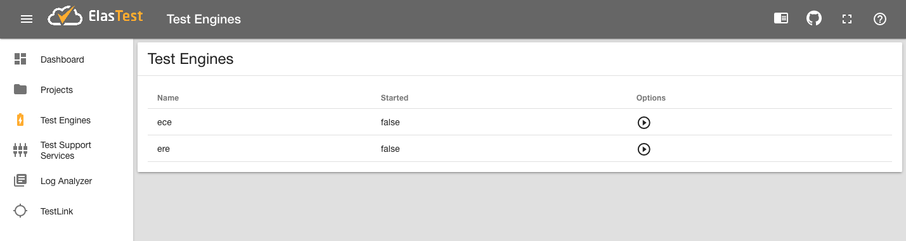
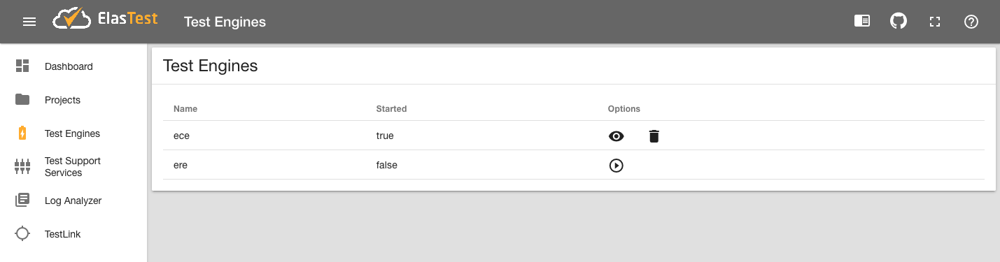
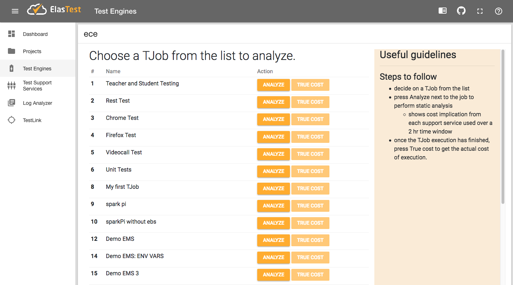

# ElasTest Cost Engine (ECE): User Guide

## Introduction
ECE is integrated with the ElasTest dashboard and allows intuitive access to testers for seeing the financial implications of executing distributed tests using cloud resources together with other support services.

Currently, ECE performs only static analysis based on the cost model defined by support service providers as part of a plan. In future releases, dynamic analysis capability will be added that will show the true cost of executing tests on real compute resources.

## Invoking ECE

- In the ElasTest dashboard, navigate to *Test Engines* page from the sidebar. 
- In the list, against *ece*, under **options** click on the **play icon**. 
  - If everything starts successfully, after a few seconds you should see **started** status change to *true*, and the **play icon** change to **view icon** as shown below.

- Click on the **view icon** to access ECE UI

## Using ECE
- ECE presents a list of all registered TJobs (see figure below)
  - Each entry has two buttons next to it:
    - Analyze (for static cost analysis)
    - True Cost (for real time dynamic cost computation), this is disabled currently.
