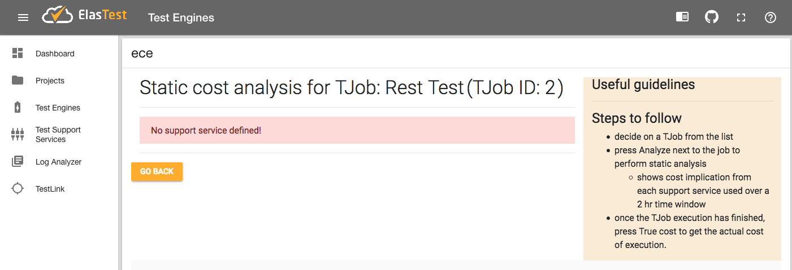

# ElasTest Cost Engine (ECE): User Guide

## Introduction
ECE is integrated with the ElasTest dashboard and allows intuitive access to testers for seeing the financial implications of executing distributed tests using cloud resources together with other support services.

Currently, ECE performs only static analysis based on the cost model defined by support service providers as part of a plan. In future releases, dynamic analysis capability will be added that will show the true cost of executing tests on real compute resources.

## Invoking ECE

- In the ElasTest dashboard, navigate to *Test Engines* page from the sidebar. 
- In the list, against *ece*, under **options** click on the **play icon**. 
  - If everything starts successfully, after a few seconds you should see **started** status change to *true*, and the **play icon** change to **view icon** as shown below.

- Click on the **view icon** to access ECE UI

## Using ECE
- ECE presents a list of all registered TJobs (see figure below)
  - Each entry has two buttons next to it:
    - Analyze (for static cost analysis)
    - True Cost (for real time dynamic cost computation), this is disabled currently.

  - choose the TJob that you are interested in analyzing statically by pressing the **analyze** button next to it.

## Interpreting the results
There are three possibilities once you press the **Analyze** button next to a TJob.

### When support services are defined in TJob
If the TJob is using support services, you will see the detailed cost analysis results per support service (see sample figures below)

The analysis shows cost implication of each service. In case multiple support services are used in a TJob, they are analyzed individually.

The analysis data has the following components -
- service plan details
- cost vs time chart showing amount of money needed to execute the test over a period of 2 hours
- cost model parameters of the support service being analyzed.

### When no support services are defined in TJob
A warning message is displayed when you try to perform static cost analysis of a TJob that uses no support services. The image below shows how the response looks like.

### When exception is raised due to incomplete data from TORM
As error message is displayed when you try to perform static cost analysis of a TJob that is incorrectly configured in TORM and is missing critical data parameters needed by ECE to function properly. The image below shows how the response looks like.

