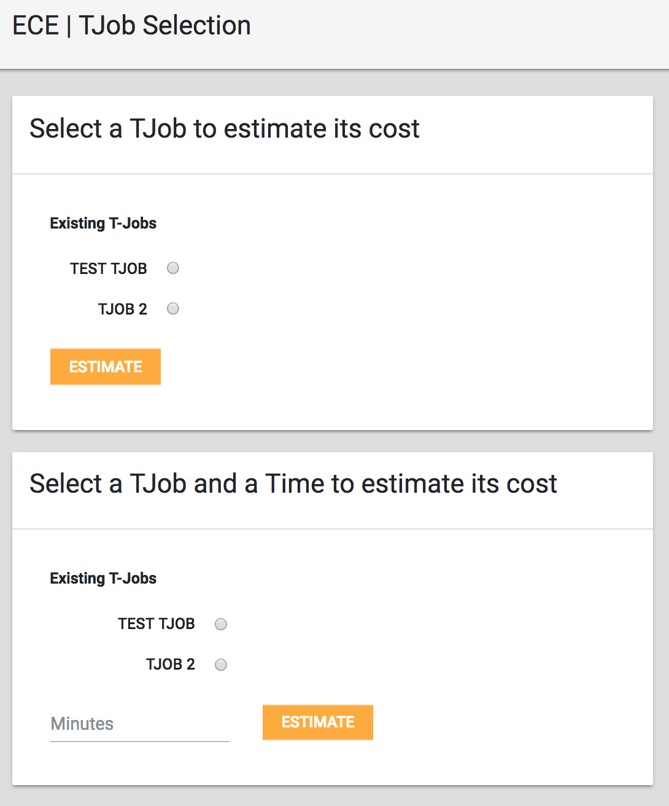
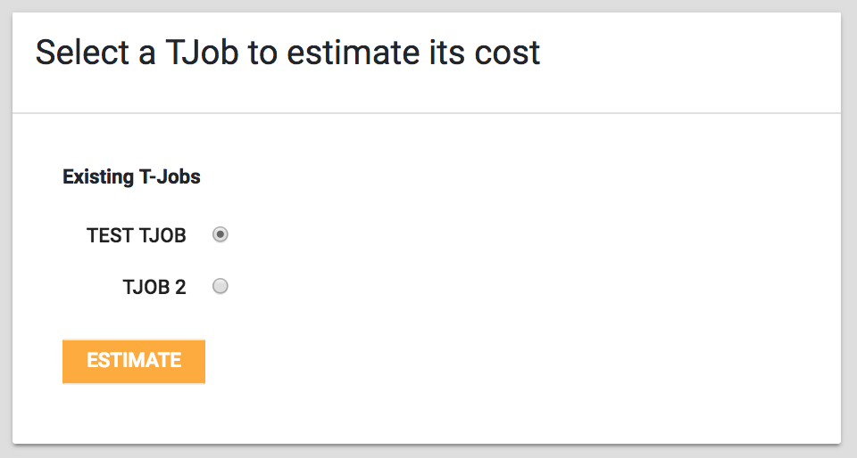
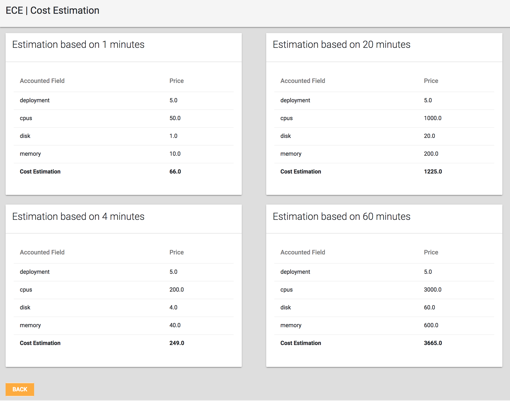
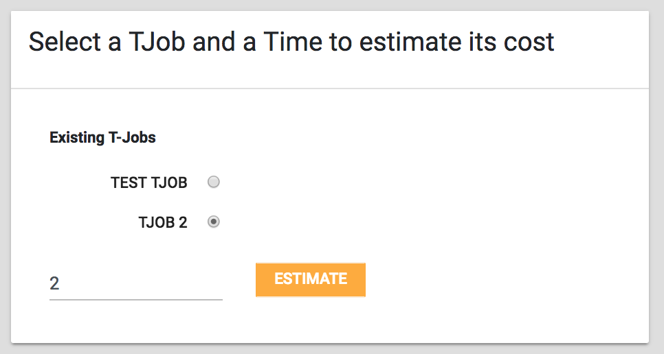
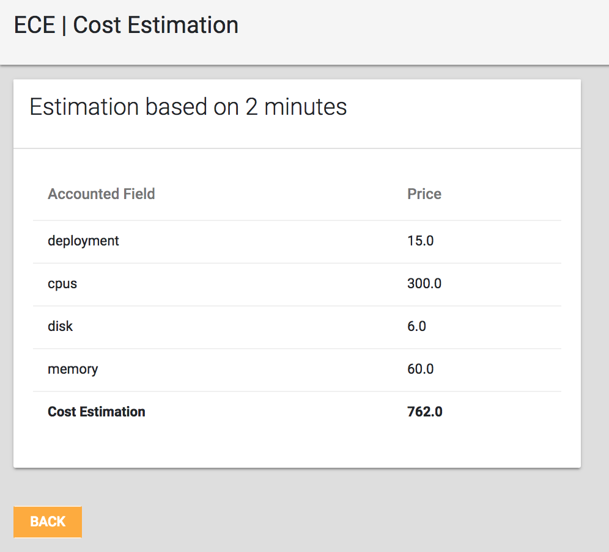

# ElasTest Cost Engine (ECE)

The Cost, Energy and Resource Consumption Modeling Engines (ECE) will be used in order to make ElasTest consider the financial of using clouds. Using clouds cost money, in third party clouds you pay for the time and resources you use. As well as in on-premises clouds, you pay for the energy and the hardware resources utilization. If ElasTest does not consider this aspects, the risk of not being financially sustainable appears.

The ECE is a service that needs information from the ElasTest Service Manager (ESM) and the ElasTest Platform Manager (EPM) for pulling information about the Platforms and Services Cost Models, and also needs information from the ElasTest Test Orchestration and Recommendation Manager (TORM) in order to know what T-Jobs can the ElasTest user estimate.

# Features

The ElasTest Cost Engine provides a friendly user interface that allows you to estimate the cost of running the existing Test Jobs on the [TORM](https://github.com/elastest/elastest-torm) and the ElasTest services used in the tests.

This version of the ECE provides:

- Estimation based on different time windows (Defaulted by when installed).
- Estimation based on a specified time window.   

# How to use ECE

The landing page of ECE allows to select between the standard (preconfigured) time windows estimation as well as the estimation with a time window defined by yourself. 

All the estimations are done based on which services are used in the TJob and their own cost definitions.

By selecting the TJobs on the first menu, the estimations will be based on the ammount of minutes defined in the [configuration file](https://github.com/elastest/elastest-cost-engine/blob/master/conf/ece.conf).

If you want to base the estimation on a time window that is not predefined in the configuration file, simply add the ammount of minutes to the second menu "Minutes" field and estimate it.  

